# Geohabilitación de Pipelines de Datos

## Proyecto de Ingeniería de Datos - USFQ

**Evelyn Nathaly Bermeo Granda**

**Oldrin Santiago Bonilla Cáceres**

**Reporte ejecutivo — Proyecto de Ingeniería de Datos Geoespaciales**

**Tecnologías:** ArcGIS Data Pipelines · ArcGIS Velocity · ArcGIS Enterprise

> Conectando pipelines de datos con el territorio para transformar información dispersa en decisiones operativas.

---

## Índice

- [Resumen ejecutivo](#resumen-ejecutivo)
- [Objetivo](#objetivo)
- [Concepto: Geohabilitación de datos](#concepto-geohabilitación-de-datos)
- [Arquitectura conceptual](#arquitectura-conceptual)
- [Casos de uso](#casos-de-uso)
  - [Caso 1: Gestión de incidencias en luminarias](#caso-1-gestión-de-incidencias-en-luminarias)
  - [Caso 2: Integración y estandarización de proyectos nacionales](#caso-2-integración-y-estandarización-de-proyectos-nacionales)
  - [Caso 3: Monitoreo de embarcaciones en tiempo real](#caso-3-monitoreo-de-embarcaciones-en-tiempo-real)
  - [Comparación de los tres casos](#comparación-de-los-tres-casos)
- [Arquitectura e infraestructura](#arquitectura-e-infraestructura)
- [Patrones de procesamiento](#patrones-de-procesamiento)
- [Resultados y valor generado](#resultados-y-valor-generado)
- [Conclusiones](#conclusiones)
- [Estructura del repositorio](#estructura-del-repositorio)
- [Documentación oficial](#documentación-oficial)

---

## Resumen ejecutivo

Este proyecto demuestra cómo la Ingeniería de Datos puede incorporar una dimensión geoespacial a los flujos de información empresarial, conectando sistemas transaccionales, fuentes externas y datos en tiempo real con el territorio.

Se desarrollaron **tres casos de uso**, cada uno representando un patrón de datos y una necesidad operativa distinta:

- **Gestión de incidencias en campo**: conecta un ERP con el sistema geoespacial para dar seguimiento al ciclo de vida de una falla, desde su detección hasta su resolución.
- **Integración multi-departamental**: consolida información geográfica de ocho áreas de una organización y de fuentes externas en una sola fuente de verdad.
- **Monitoreo en tiempo real**: procesa la posición de embarcaciones en la costa para apoyar decisiones de seguridad.

En los tres casos, **ArcGIS Enterprise** actúa como infraestructura geoespacial común, mientras que **ArcGIS Data Pipelines** y **ArcGIS Velocity** cumplen el rol de motores de integración batch y de procesamiento en tiempo real, respectivamente.

---

## Objetivo

Demostrar cómo la geohabilitación de pipelines de datos permite integrar y procesar información proveniente de sistemas empresariales, fuentes externas y flujos en tiempo real, mediante procesos batch y streaming, generando información geoespacial confiable para el monitoreo y la toma de decisiones.

**Objetivos específicos:**

- Integrar un sistema ERP con el entorno geoespacial para gestionar y visualizar el ciclo completo de una incidencia de campo, desde su detección hasta su resolución.
- Integrar, transformar y estandarizar información geográfica proveniente de múltiples departamentos y fuentes externas, consolidándola en un único Feature Layer para su análisis y visualización.
- Procesar y visualizar datos en tiempo real sobre la ubicación y movimiento de embarcaciones, generando información geoespacial que apoye el monitoreo y la toma de decisiones.
- Demostrar la integración de ArcGIS Enterprise, ArcGIS Data Pipelines y ArcGIS Velocity como una arquitectura común para el procesamiento de datos tanto batch como en tiempo real.

---

## Concepto: Geohabilitación de datos

**Geohabilitar** un pipeline de datos significa incorporarle una referencia espacial para que la información —sin importar su origen— pueda ubicarse, visualizarse y analizarse sobre el territorio.

Un dato aislado en una tabla de un ERP o en un archivo JSON tiene valor limitado. El mismo dato, geohabilitado, permite:

- Ubicar un evento o un objeto en el espacio.
- Integrarse con otras capas de información geográfica.
- Visualizarse en escenas, mapas y dashboards.
- Convertirse en insumo directo para la toma de decisiones.

La narrativa que conecta a los tres casos de este proyecto sigue el mismo patrón conceptual:


---

## Arquitectura conceptual

Los tres casos comparten una misma lógica: distintas fuentes alimentan un motor de procesamiento, y el resultado geohabilitado se consume mediante visualizaciones orientadas a la decisión.

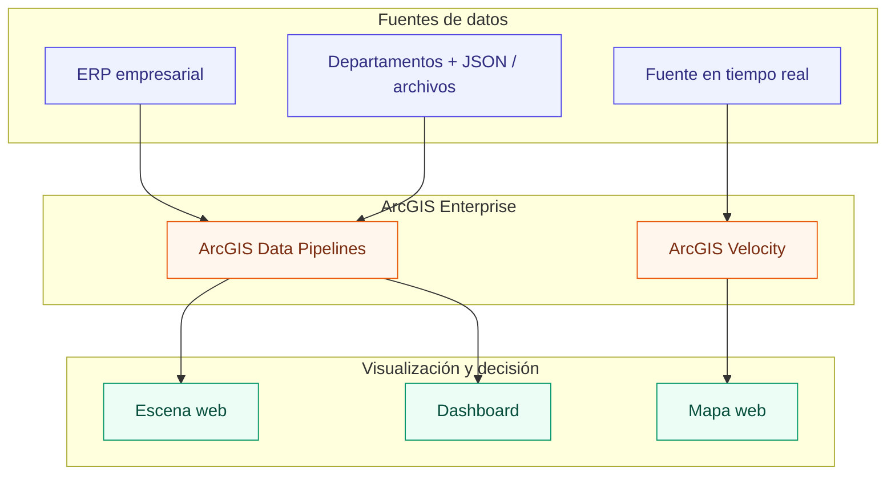

- **ArcGIS Data Pipelines** resuelve los patrones batch y programados: integración del ERP (Caso 1) y de fuentes multi-departamentales (Caso 2).
- **ArcGIS Velocity** resuelve el patrón de tiempo real: posición de embarcaciones (Caso 3).
- **ArcGIS Enterprise** provee la infraestructura común de almacenamiento, publicación y visualización para ambos motores.

---

## Casos de uso

### Caso 1: Gestión de incidencias en luminarias

**Roles involucrados**

| Rol | Necesidad |
|---|---|
| Responsable de Operaciones | Identificar las luminarias afectadas y conocer su estado |
| Técnico de Campo | Localizar la incidencia, atenderla y reportarla como solucionada |

**El reto**

Conectar el ERP con el sistema geoespacial para reflejar cada cambio en el territorio, desde la falla hasta su resolución.

**La solución**

Un pipeline en ArcGIS Data Pipelines ingesta información del ERP: historial de fallas, luminarias, transformadores y técnicos disponibles. El flujo transforma e integra estas fuentes y actualiza los feature layers que alimentan una **escena web** de monitoreo.

Desde esta escena, el responsable de operaciones identifica las luminarias afectadas y coordina la atención con el técnico de campo. Una vez resuelta la incidencia, el técnico la reporta como solucionada y, mediante un **webhook**, el estado se propaga de regreso hacia los feature layers, actualizando automáticamente el visor de monitoreo.

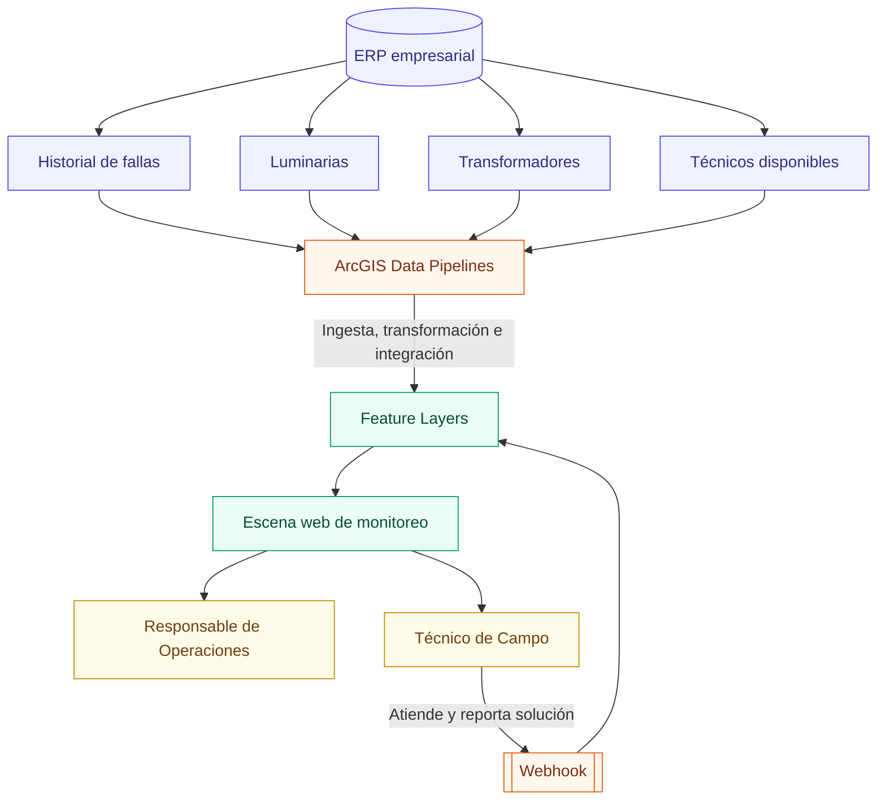

**Evidencia visual**

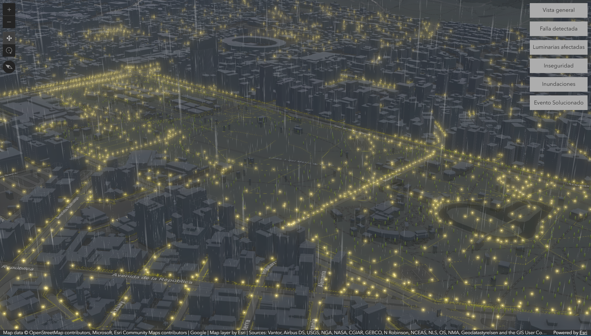

*Escena web utilizada por el responsable de operaciones para monitorear el estado de las luminarias.*

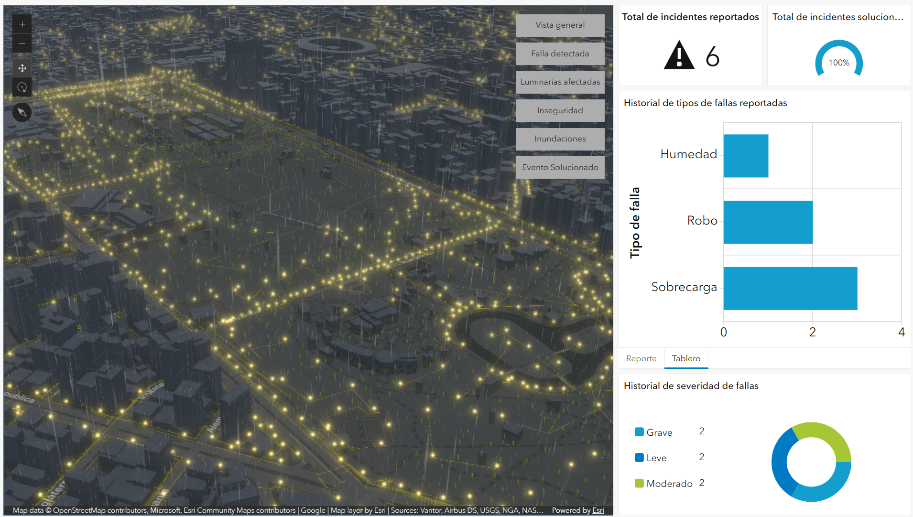

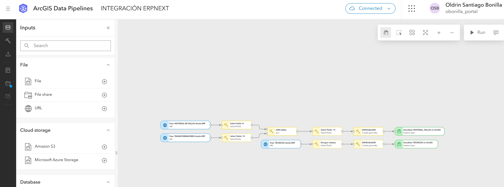

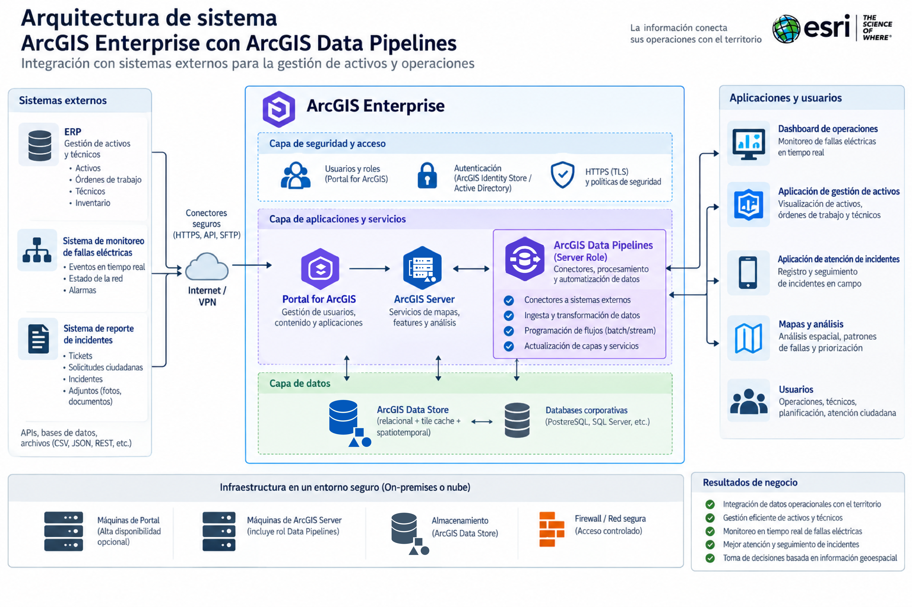

---

### Caso 2: Integración y estandarización de proyectos nacionales

**Roles involucrados**

| Rol | Necesidad |
|---|---|
| Coordinador de Proyectos | Conocer diariamente el estado de los proyectos a nivel nacional |
| Especialista en Geomática e Ingeniería de Datos | Integrar y estandarizar la información de los distintos departamentos |

**El reto**

La información de proyectos está distribuida entre ocho departamentos —Obras Públicas, Patrimonio, Riego, Gestión Ambiental, Servicios Sociales, Planificación Territorial, Desarrollo Económico y Participación Ciudadana— además de fuentes externas como archivos JSON. Cada fuente utiliza su propia estructura, lo que dificulta consolidar, estandarizar y automatizar una visión nacional de los proyectos.

**La solución**

Un flujo en ArcGIS Data Pipelines ingesta la información geográfica de los ocho departamentos y de fuentes externas, estandariza sus estructuras y atributos, y actualiza diariamente un **feature layer consolidado**. A partir de esta fuente única se alimenta un **dashboard** de monitoreo nacional.

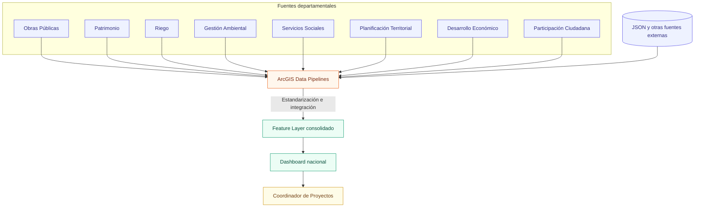

**Evidencia visual**

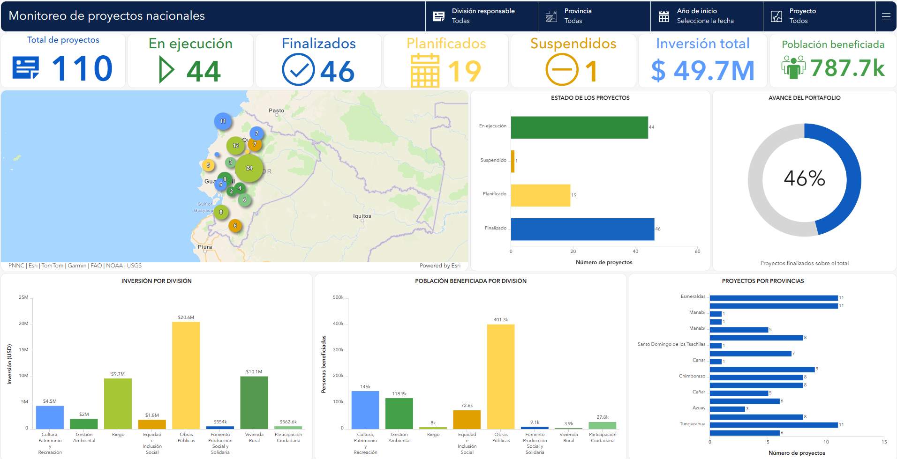

*Dashboard alimentado diariamente por el feature layer consolidado.*

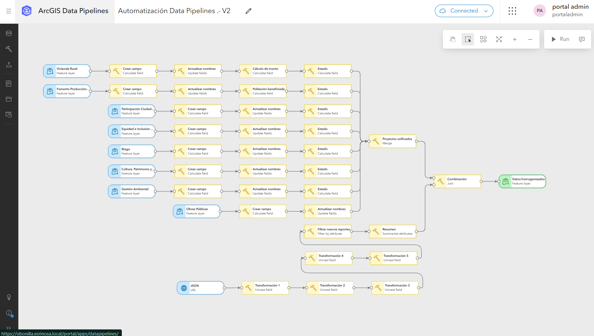

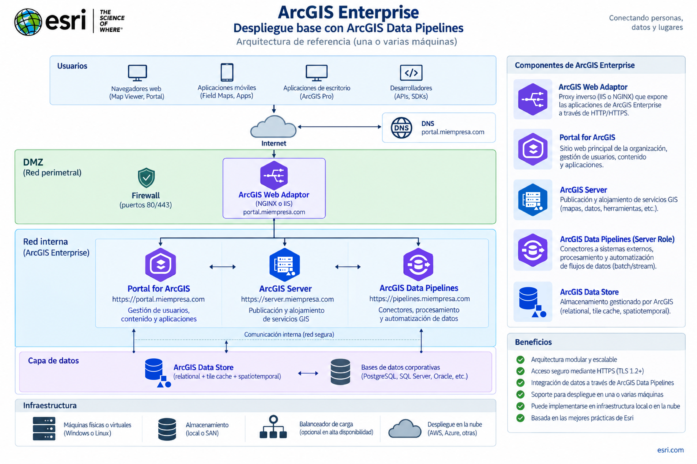

---

### Caso 3: Monitoreo de embarcaciones en tiempo real

**Roles involucrados**

| Rol | Necesidad |
|---|---|
| Responsable de Seguridad Nacional | Monitorear en tiempo real las embarcaciones para detectar posibles actividades ilícitas |
| Arquitecto de Soluciones | Integrar los datos mediante un pipeline en tiempo real |

**El reto**

Visualizar y monitorear en un mapa web la trayectoria de las embarcaciones en la costa ecuatoriana, con el fin de apoyar la seguridad y la toma de decisiones.

**La solución**

El flujo se implementó con ArcGIS Velocity, que recibe de forma continua la ubicación de las embarcaciones, la procesa y mantiene actualizada su representación geoespacial. La información resultante alimenta un **mapa web** donde se observa la ubicación, el movimiento y la trayectoria de cada embarcación conforme se actualiza en tiempo real.

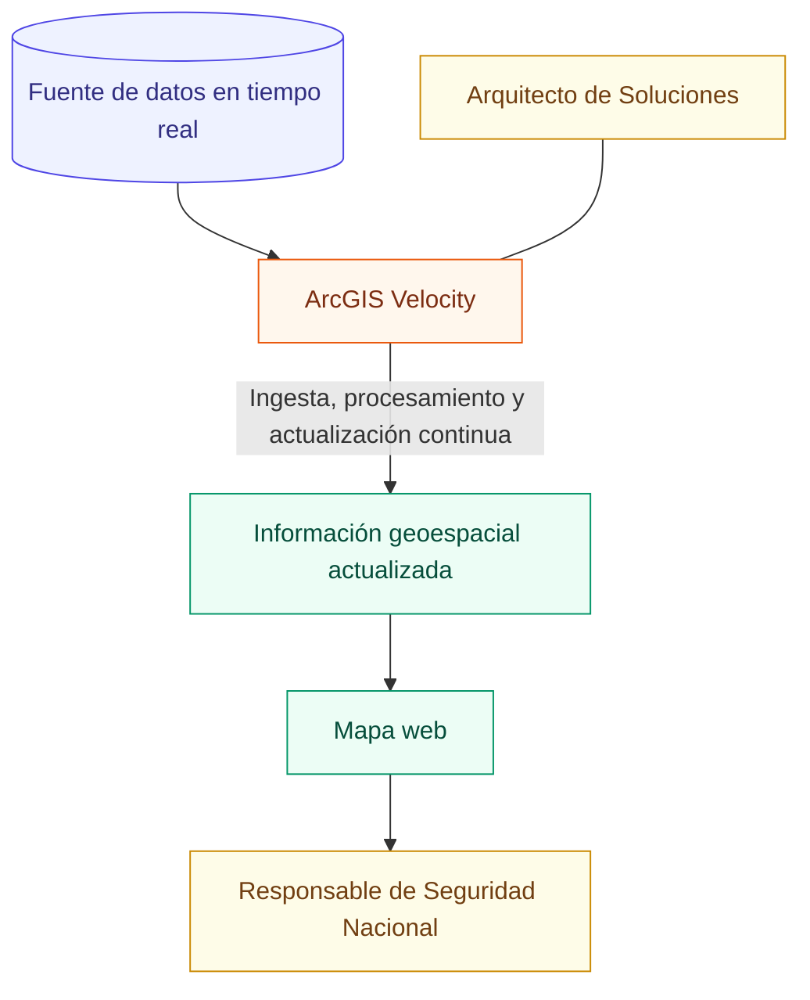

**Evidencia visual**

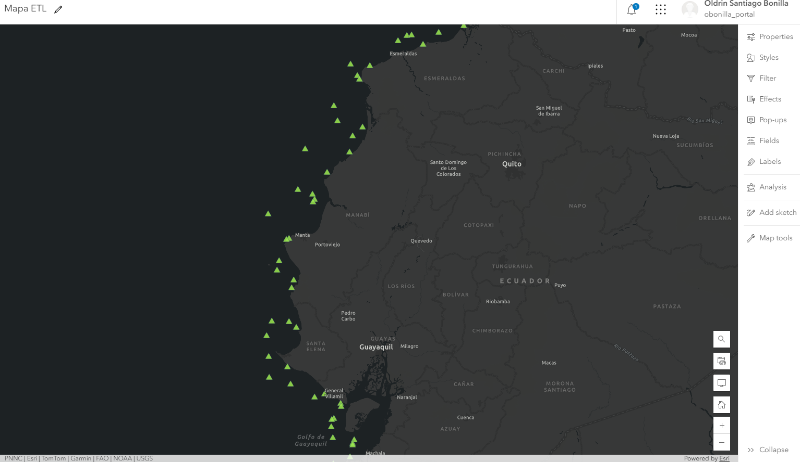

*Mapa web con la ubicación y trayectoria de las embarcaciones, actualizado en tiempo real.*

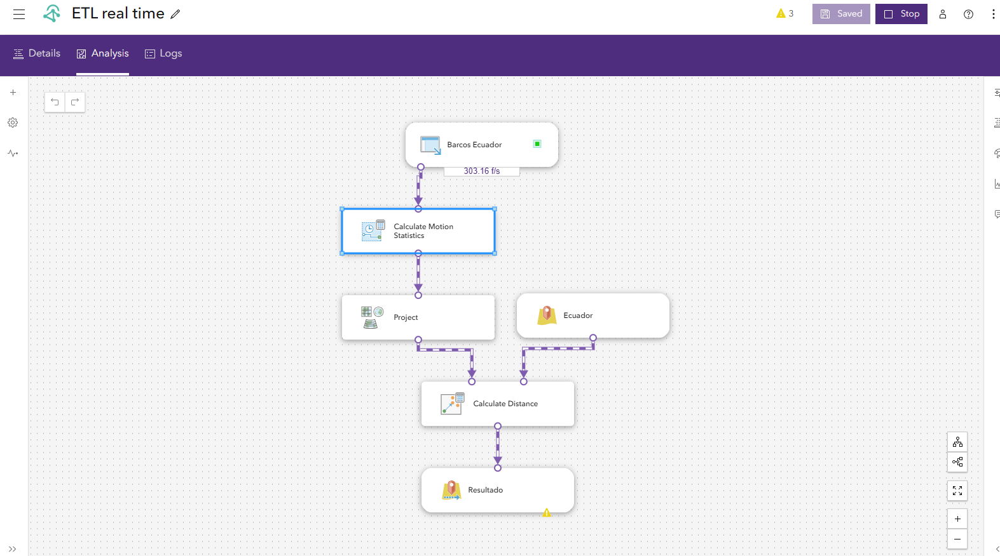


---

### Comparación de los tres casos

| **Caso** | **Necesidad** | **Patrón de datos** | **Tecnología** | **Flujo de procesamiento** | **Resultado** |
|---|---|---|---|---|---|
| **1 · Luminarias** | Gestión del ciclo de incidencias en campo | Batch + eventos | ArcGIS Data Pipelines | ERP → ETL → Feature Layer → Webhook | Escena web actualizada |
| **2 · Proyectos nacionales** | Integración y homogeneización de múltiples fuentes | Batch programado | ArcGIS Data Pipelines | Feature Layers + JSON → ETL → Feature Layer consolidado | Dashboard de monitoreo |
| **3 · Embarcaciones** | Monitoreo de ubicación y movimiento | Streaming / tiempo real | ArcGIS Velocity | Feed → procesamiento continuo → salida geoespacial | Mapa web en tiempo real |

---

## Arquitectura e infraestructura

Los tres casos operan sobre una misma infraestructura geoespacial empresarial. Esta sección describe, de forma conceptual, cómo se organiza esa infraestructura.

### ArcGIS Enterprise: arquitectura base

Plataforma geoespacial empresarial que centraliza el almacenamiento, la publicación de servicios y la gestión de contenido, y sirve como base sobre la cual operan tanto los procesos batch como los de tiempo real.

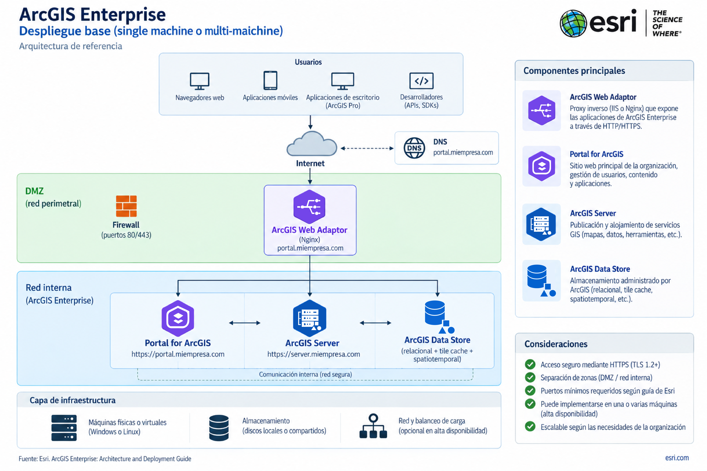

### Enterprise + Data Pipelines

Incorpora la capacidad de diseñar flujos de ingesta, transformación e integración de datos —batch y programados— directamente sobre la infraestructura de Enterprise, publicando los resultados como feature layers listos para consumo.


### Enterprise + Velocity

Añade la capacidad de recibir, procesar y actualizar información en tiempo real, manteniendo sincronizada la representación geoespacial de fenómenos dinámicos.

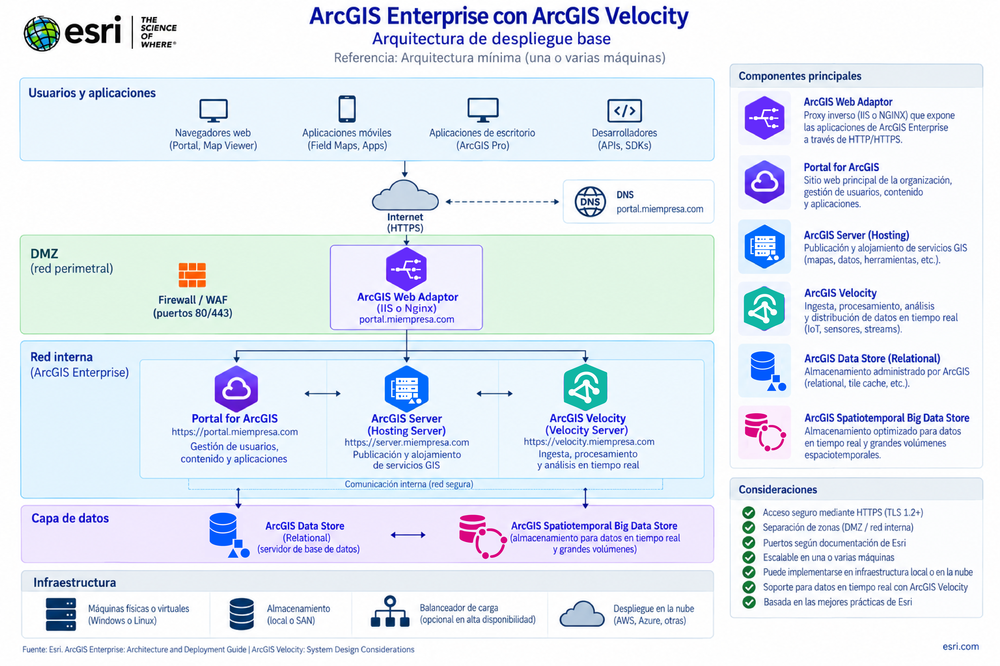

### Arquitectura integrada

Combina Enterprise, Data Pipelines, Velocity e Image Server en una sola plataforma capaz de atender distintos patrones de datos —batch, programado, empresarial, geográfico, tiempo real y procesamiento de imágenes— sin generar silos tecnológicos.

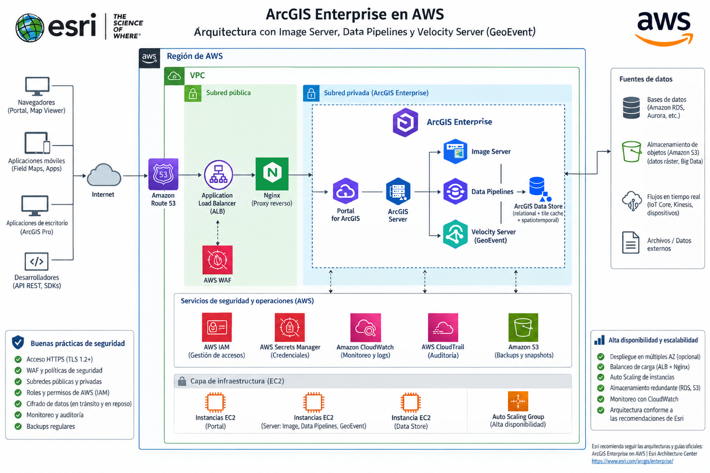

---

## Patrones de procesamiento

| Patrón | Descripción | Casos relacionados |
|---|---|---|
| **Batch** | Procesamiento de datos en lotes, ejecutado de forma periódica | Caso 1 · Caso 2 |
| **Automatización** | Flujos que actualizan la información sin intervención manual repetitiva | Caso 1 · Caso 2 |
| **Integración de fuentes** | Consolidación de datos provenientes de sistemas y formatos distintos (ERP, feature layers departamentales, JSON) | Caso 1 · Caso 2 |
| **Tiempo real** | Procesamiento continuo de eventos para mantener la información siempre actualizada | Caso 3 |

---

## Resultados y valor generado

| Resultado | Caso 1 · Luminarias | Caso 2 · Proyectos | Caso 3 · Embarcaciones |
|---|:---:|:---:|:---:|
| Integración de fuentes heterogéneas | ✔️ | ✔️ | |
| Automatización de procesos | ✔️ | ✔️ | |
| Estandarización de información | | ✔️ | |
| Centralización de datos | | ✔️ | |
| Actualización de información geoespacial | ✔️ | ✔️ | ✔️ |
| Visualización operacional | ✔️ | ✔️ | ✔️ |
| Procesamiento en tiempo real | | | ✔️ |
| Soporte a la toma de decisiones | ✔️ | ✔️ | ✔️ |
| Conexión entre sistemas de datos y el territorio | ✔️ | ✔️ | ✔️ |

---

## Conclusiones

Los tres casos demuestran cómo una arquitectura de datos geoespaciales puede responder a distintas necesidades y velocidades de información: gestionar incidencias de campo, integrar información de múltiples áreas y monitorear eventos en tiempo real.

La geohabilitación aporta el contexto espacial a los datos, permitiendo pasar de información dispersa y aislada a información integrada, contextualizada y útil para la toma de decisiones.

ArcGIS Data Pipelines permite automatizar los procesos de integración y transformación batch, mientras que ArcGIS Velocity incorpora la ingesta y el procesamiento de datos en tiempo real.

En conjunto, estas capacidades pueden integrarse dentro del ecosistema ArcGIS Enterprise, conformando una arquitectura geoespacial capaz de soportar procesos batch y streaming para diferentes necesidades operativas.

El valor no está únicamente en integrar los datos, sino en agregarles contexto espacial y entregarlos con la velocidad necesaria para convertirlos en decisiones.

> **El dato informa. El territorio contextualiza. La Ingeniería de Datos lo conecta.**

---

## Estructura del repositorio

```text
.
├── README.md
│
└── www/
    ├── caso-01/
    │   ├── escena-luminarias.png
    │   ├── integracion-erp.png
    │   ├── pipeline-data-pipelines.png
    │   └── arquitectura.png
    │
    ├── caso-02/
    │   ├── pipeline-integracion.png
    │   ├── dashboard-proyectos.png
    │   └── arquitectura.png
    │
    ├── caso-03/
    │   ├── velocity-pipeline.png
    │   ├── mapa-embarcaciones.png
    │   └── arquitectura.png
    │
    └── arquitectura/
        ├── enterprise-base.png
        ├── enterprise-data-pipelines.png
        ├── enterprise-velocity.png
        └── enterprise-integrated.png
```

---

## Documentación oficial

Recursos oficiales de Esri para profundizar en las tecnologías utilizadas en este proyecto:

### ArcGIS Data Pipelines

- [Documentación técnica de ArcGIS Data Pipelines](https://doc.esri.com/es/arcgis-data-pipelines/latest/index.html) — instalación, primeros pasos y tareas esenciales.
- [Recursos y tutoriales de ArcGIS Data Pipelines](https://www.esri.com/es-es/arcgis/products/arcgis-data-pipelines/resources) — tutoriales, preguntas frecuentes y blog del producto.

### ArcGIS Velocity

- [Documentación técnica de ArcGIS Velocity](https://doc.esri.com/en/arcgis-velocity) — configuración, primeros pasos y tareas esenciales (en inglés).
- [Recursos y tutoriales de ArcGIS Velocity](https://www.esri.com/es-es/arcgis/products/arcgis-velocity/resources) — tutoriales, opciones de implementación y comunidad.